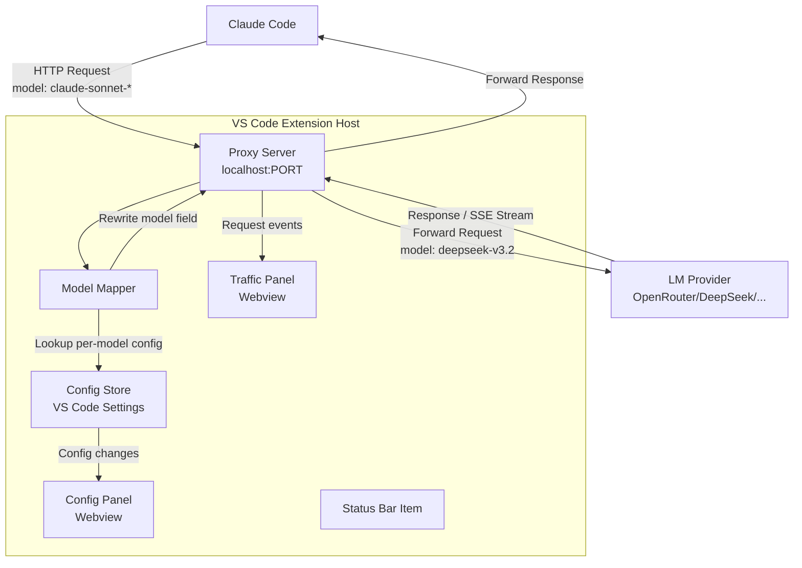

# Design Document: Claude Code Model Mapper

## Overview

Claude Code Model Mapper là một VS Code extension hoạt động như một lớp proxy trung gian giữa Claude Code và các LLM provider thực tế. Extension khởi động một local HTTP proxy server, nhận request từ Claude Code, ánh xạ `model` field theo cấu hình per-model của người dùng, rồi chuyển tiếp đến LM Provider thực tế.

Luồng chính:

```
Claude Code → Proxy Server (localhost:PORT) → Model Mapper → LM Provider (OpenRouter/DeepSeek/...)
```

Claude Code tự động chọn model theo task (haiku/sonnet/opus). Proxy intercept request, tra cứu mapping, thay thế tên model, rồi forward toàn bộ request (headers, body, auth) đến provider thực tế. Response (bao gồm streaming SSE) được forward nguyên vẹn về Claude Code.

Extension cung cấp:
- Config Panel: quản lý per-model mapping
- Traffic Panel: theo dõi request real-time
- Status Bar: trạng thái proxy server
- VS Code commands: khởi động/dừng proxy, mở panels

## Architecture



### Các thành phần chính

1. **Extension Host** (`extension.ts`): Entry point, lifecycle management, đăng ký commands/providers
2. **Proxy Server** (`proxyServer.ts`): HTTP server (Node.js `http` module), xử lý request/response forwarding và SSE streaming
3. **Model Mapper** (`modelMapper.ts`): Logic tra cứu và ánh xạ model (exact match + prefix match)
4. **Config Store** (`configStore.ts`): Đọc/ghi VS Code settings và SecretStorage
5. **Traffic Panel** (`trafficPanel.ts`): WebviewProvider hiển thị request list real-time
6. **Config Panel** (`configPanel.ts`): WebviewProvider quản lý model mappings
7. **Status Bar** (`statusBar.ts`): Hiển thị trạng thái proxy

## Components and Interfaces

### ProxyServer

```typescript
interface ProxyServerOptions {
  port: number;
  portRangeEnd: number; // thử port tiếp theo nếu bị chiếm
}

interface ProxyServer {
  start(options: ProxyServerOptions): Promise<number>; // trả về port thực tế
  stop(): Promise<void>;
  onRequest(handler: (event: RequestEvent) => void): Disposable;
  readonly actualPort: number | null;
  readonly isRunning: boolean;
}
```

### ModelMapper

```typescript
interface ModelMapper {
  // Exact match trước, sau đó prefix match
  resolve(sourceModel: string, configs: ModelConfig[]): string;
}
```

Thuật toán resolve:
1. Tìm exact match: `config.sourceModel === sourceModel`
2. Nếu không có, tìm prefix match: `sourceModel.startsWith(config.sourceModel)`
3. Nếu vẫn không có, trả về `sourceModel` gốc (pass-through)

### ConfigStore

```typescript
interface ModelConfig {
  sourceModel: string; // e.g. "claude-haiku"
  targetModel: string; // e.g. "minimax/minimax-m2.5"
  enabled: boolean;
}

interface LMProviderConfig {
  baseUrl: string;       // e.g. "https://openrouter.ai/api/v1"
  // apiKey lưu trong SecretStorage, không trong settings
}

interface ConfigStore {
  getModelConfigs(): ModelConfig[];
  setModelConfigs(configs: ModelConfig[]): Promise<void>;
  getLMProviderConfig(): LMProviderConfig;
  setLMProviderConfig(config: LMProviderConfig): Promise<void>;
  getApiKey(): Promise<string | undefined>;
  setApiKey(key: string): Promise<void>;
  getProxyPort(): number;
  onDidChange(handler: () => void): Disposable;
}
```

### TrafficPanel

```typescript
type RequestStatus = 'queued' | 'processing' | 'completed' | 'error';

interface RequestEvent {
  id: string;           // e.g. "req-69b7"
  sourceModel: string;
  targetModel: string;
  status: RequestStatus;
  startTime: number;    // Date.now()
  endTime?: number;
  error?: string;
}

interface TrafficPanel {
  show(): void;
  addRequest(event: RequestEvent): void;
  updateRequest(id: string, update: Partial<RequestEvent>): void;
  clearCompleted(): void;
}
```

### ConfigPanel

```typescript
interface ConfigPanel {
  show(): void;
  // Nhận config updates từ webview qua message passing
  // Gửi config hiện tại xuống webview khi mở
}
```

### Webview Message Protocol

Config Panel ↔ Extension Host:
```typescript
// Webview → Extension
type ConfigPanelMessage =
  | { type: 'saveConfigs'; configs: ModelConfig[] }
  | { type: 'saveLMProvider'; config: LMProviderConfig; apiKey?: string }
  | { type: 'ready' }

// Extension → Webview
type ConfigPanelResponse =
  | { type: 'init'; configs: ModelConfig[]; lmProvider: LMProviderConfig }
  | { type: 'saved' }
  | { type: 'error'; message: string }
```

Traffic Panel ↔ Extension Host:
```typescript
// Extension → Webview
type TrafficPanelMessage =
  | { type: 'init'; requests: RequestEvent[] }
  | { type: 'add'; request: RequestEvent }
  | { type: 'update'; id: string; update: Partial<RequestEvent> }
  | { type: 'clear' }

// Webview → Extension
type TrafficPanelCommand =
  | { type: 'clearCompleted' }
  | { type: 'ready' }
```

## Data Models

### VS Code Settings Schema

```json
{
  "claudeCodeModelMapper.proxyPort": {
    "type": "number",
    "default": 3456,
    "description": "Port cho proxy server. Nếu bị chiếm, sẽ thử port tiếp theo."
  },
  "claudeCodeModelMapper.proxyPortRangeEnd": {
    "type": "number",
    "default": 3466,
    "description": "Port tối đa trong dải thử."
  },
  "claudeCodeModelMapper.modelConfigs": {
    "type": "array",
    "default": [],
    "items": {
      "type": "object",
      "properties": {
        "sourceModel": { "type": "string" },
        "targetModel": { "type": "string" },
        "enabled": { "type": "boolean", "default": true }
      },
      "required": ["sourceModel", "targetModel"]
    }
  },
  "claudeCodeModelMapper.lmProvider": {
    "type": "object",
    "default": { "baseUrl": "https://openrouter.ai/api/v1" },
    "properties": {
      "baseUrl": { "type": "string" }
    }
  }
}
```

### SecretStorage

- Key: `claudeCodeModelMapper.apiKey` → API key của LM Provider

### Default Template Configs

Extension gợi ý template mặc định khi chưa có config:

```json
[
  { "sourceModel": "claude-haiku",  "targetModel": "minimax/minimax-m2.5",    "enabled": true },
  { "sourceModel": "claude-sonnet", "targetModel": "deepseek/deepseek-v3.2",  "enabled": true },
  { "sourceModel": "claude-opus",   "targetModel": "z-ai/glm5",               "enabled": true }
]
```

### RequestEvent Storage

Traffic Panel giữ tối đa 200 `RequestEvent` trong memory (không persist). Khi vượt 200, xóa các entry cũ nhất đã completed/error.

### Request ID Generation

```
req-{4 hex chars từ timestamp + random}
// e.g. "req-69b7"
```

## Correctness Properties

*A property is a characteristic or behavior that should hold true across all valid executions of a system — essentially, a formal statement about what the system should do. Properties serve as the bridge between human-readable specifications and machine-verifiable correctness guarantees.*


### Property 1: Model resolution — exact match

*For any* danh sách `ModelConfig` và `sourceModel` có exact match với một config, hàm `resolve()` phải trả về `targetModel` của config đó.

**Validates: Requirements 3.1, 3.2**

### Property 2: Model resolution — prefix match

*For any* danh sách `ModelConfig` và `sourceModel` không có exact match nhưng có prefix match (ví dụ: `"claude-haiku-4-5-20251001"` match với config `"claude-haiku"`), hàm `resolve()` phải trả về `targetModel` của config prefix đó. Edge cases: haiku variants (6.2), sonnet variants (6.3), opus variants (6.4) đều phải được cover.

**Validates: Requirements 6.5, 6.2, 6.3, 6.4**

### Property 3: Pass-through khi không có match

*For any* `sourceModel` không khớp với bất kỳ config nào (cả exact lẫn prefix), hàm `resolve()` phải trả về chính `sourceModel` đó không thay đổi.

**Validates: Requirements 3.3**

### Property 4: Config uniqueness invariant

*For any* thao tác thêm/sửa `ModelConfig` vào danh sách, danh sách kết quả không được chứa hai config có cùng `sourceModel`. Nếu thêm config với `sourceModel` đã tồn tại, config cũ phải được thay thế (upsert) hoặc thao tác bị từ chối.

**Validates: Requirements 1.4**

### Property 5: Config persistence round-trip

*For any* danh sách `ModelConfig` hợp lệ được lưu vào `ConfigStore`, đọc lại ngay sau đó phải trả về danh sách tương đương. Tương tự với `LMProviderConfig` (baseUrl) và API key qua SecretStorage.

**Validates: Requirements 1.5, 5.1, 5.2**

### Property 6: Config validation — reject empty fields

*For any* `ModelConfig` có `sourceModel` hoặc `targetModel` là chuỗi rỗng hoặc chỉ chứa whitespace, hàm validation phải trả về lỗi và không lưu config đó.

**Validates: Requirements 1.2, 1.7**

### Property 7: URL validation — reject non-HTTP/HTTPS

*For any* chuỗi không bắt đầu bằng `http://` hoặc `https://`, validation của `baseUrl` phải trả về lỗi.

**Validates: Requirements 5.4**

### Property 8: Request headers và body được giữ nguyên

*For any* HTTP request đến proxy, tất cả headers (trừ `Host`), toàn bộ body, và authentication token phải được forward nguyên vẹn đến LM Provider — chỉ field `model` trong body được thay thế theo mapping.

**Validates: Requirements 3.5**

### Property 9: Traffic panel request count limit

*For any* số lượng request được thêm vào Traffic Panel, số lượng entries trong panel không bao giờ vượt quá 200. Khi vượt ngưỡng, các entries cũ nhất đã completed/error phải bị xóa trước.

**Validates: Requirements 4.9**

### Property 10: Clear completed removes finished requests

*For any* trạng thái Traffic Panel, sau khi gọi `clearCompleted()`, danh sách không còn chứa bất kỳ request nào có status `completed` hoặc `error`. Các request đang `queued` hoặc `processing` phải được giữ lại.

**Validates: Requirements 4.8**

### Property 11: RequestEvent invariants

*For any* `RequestEvent` được tạo ra bởi proxy: (a) `status` phải là một trong bốn giá trị hợp lệ `queued | processing | completed | error`; (b) nếu `endTime` tồn tại thì `endTime >= startTime` (duration không âm); (c) `id`, `sourceModel`, `targetModel` phải là chuỗi không rỗng.

**Validates: Requirements 4.2, 4.5, 4.6**

## Error Handling

### Proxy Server Errors

| Tình huống | Xử lý |
|---|---|
| Port bị chiếm | Thử port tiếp theo trong range `[proxyPort, proxyPortRangeEnd]`. Nếu hết range, báo lỗi cho người dùng. |
| LM Provider không phản hồi / timeout | Trả về HTTP 502 về Claude Code, log lỗi, cập nhật RequestEvent status thành `error`. |
| LM Provider trả về lỗi HTTP (4xx/5xx) | Forward nguyên response về Claude Code, cập nhật status thành `error`. |
| Proxy server crash | Extension Host phát hiện qua process exit event, tự động restart sau 1s delay. Thông báo cho người dùng nếu restart thất bại 3 lần liên tiếp. |
| Request body không phải JSON hợp lệ | Trả về HTTP 400, log lỗi. |

### Config Validation Errors

| Tình huống | Xử lý |
|---|---|
| `sourceModel` hoặc `targetModel` rỗng/whitespace | Hiển thị inline error trong Config Panel, không lưu. |
| `baseUrl` không phải HTTP/HTTPS | Hiển thị inline error, không lưu. |
| Trùng lặp `sourceModel` | Hiển thị cảnh báo, hỏi người dùng có muốn ghi đè không. |

### Extension Lifecycle Errors

- Nếu proxy không thể khởi động khi extension activate: hiển thị VS Code error notification với nút "Retry" và "View Logs".
- Nếu VS Code settings bị corrupt: reset về default config, thông báo người dùng.

## Testing Strategy

### Dual Testing Approach

Extension sử dụng cả unit tests và property-based tests để đảm bảo correctness toàn diện.

**Unit tests** tập trung vào:
- Specific examples và integration points (proxy start/stop, SSE streaming)
- Edge cases cụ thể (port conflict, empty config list)
- Error conditions (invalid URL, network timeout)

**Property-based tests** tập trung vào:
- Universal properties của ModelMapper (resolution logic)
- Invariants của ConfigStore (uniqueness, round-trip)
- Invariants của TrafficPanel (count limit, status enum)

### Technology Stack

- **Test runner**: [Vitest](https://vitest.dev/) (compatible với VS Code extension testing)
- **Property-based testing library**: [fast-check](https://fast-check.io/) cho TypeScript
- **Mocking**: VS Code API mock (`@vscode/test-electron` hoặc manual mocks)

### Property-Based Test Configuration

Mỗi property test phải:
- Chạy tối thiểu **100 iterations** (fast-check default là 100, giữ nguyên hoặc tăng)
- Có comment tag theo format: `// Feature: claude-code-model-mapper, Property {N}: {property_text}`
- Tham chiếu đúng property number trong design document

Ví dụ:

```typescript
// Feature: claude-code-model-mapper, Property 1: Model resolution — exact match
it('resolves exact match correctly', () => {
  fc.assert(
    fc.property(
      fc.array(fc.record({ sourceModel: fc.string(), targetModel: fc.string(), enabled: fc.boolean() })),
      fc.string(),
      (configs, sourceModel) => {
        const exactMatch = configs.find(c => c.sourceModel === sourceModel && c.enabled);
        const result = modelMapper.resolve(sourceModel, configs);
        if (exactMatch) {
          return result === exactMatch.targetModel;
        }
        return true; // covered by other properties
      }
    ),
    { numRuns: 100 }
  );
});
```

### Test Coverage Map

| Property | Test Type | File |
|---|---|---|
| P1: Exact match resolution | property | `modelMapper.test.ts` |
| P2: Prefix match resolution | property | `modelMapper.test.ts` |
| P3: Pass-through no match | property | `modelMapper.test.ts` |
| P4: Config uniqueness | property | `configStore.test.ts` |
| P5: Config round-trip | property | `configStore.test.ts` |
| P6: Validation empty fields | property | `validation.test.ts` |
| P7: URL validation | property | `validation.test.ts` |
| P8: Headers preserved | property | `proxyServer.test.ts` |
| P9: Request count limit | property | `trafficPanel.test.ts` |
| P10: Clear completed | property | `trafficPanel.test.ts` |
| P11: RequestEvent invariants | property | `trafficPanel.test.ts` |
| Proxy start/stop | unit | `proxyServer.test.ts` |
| Port conflict fallback | unit | `proxyServer.test.ts` |
| SSE streaming | unit | `proxyServer.test.ts` |
| Default template config | unit | `configStore.test.ts` |
